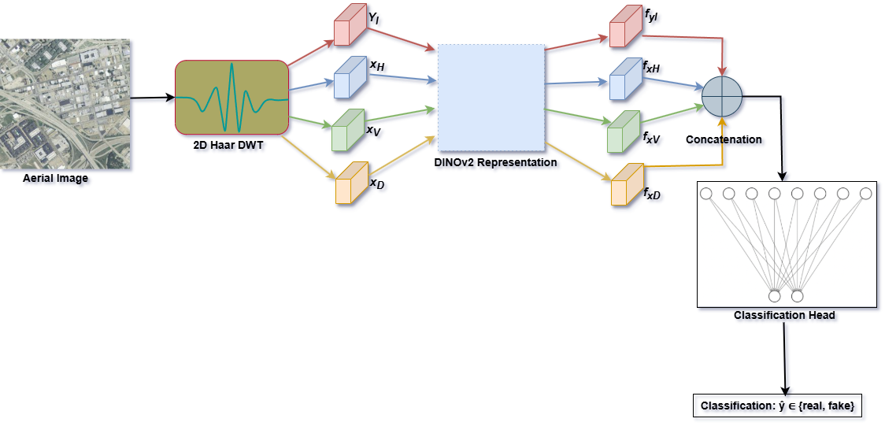

# Forensic Detection of AI-Generated Aerial Imagery for Securing Remote Sensing Cyber-Physical Systems

 

## Code
Official implementation of the chapter: "Forensic Detection of AI-Generated Aerial Imagery for Securing Remote Sensing Cyber-Physical Systems"

This repository introduces **Wavelet-DINO**, a new forensic detection framework that synergizes self-supervised semantic representations from DINOv2 with frequency-aware features derived via 2D Haar Discrete Wavelet Transform (DWT) for robust detection of generated aerial imagery.
